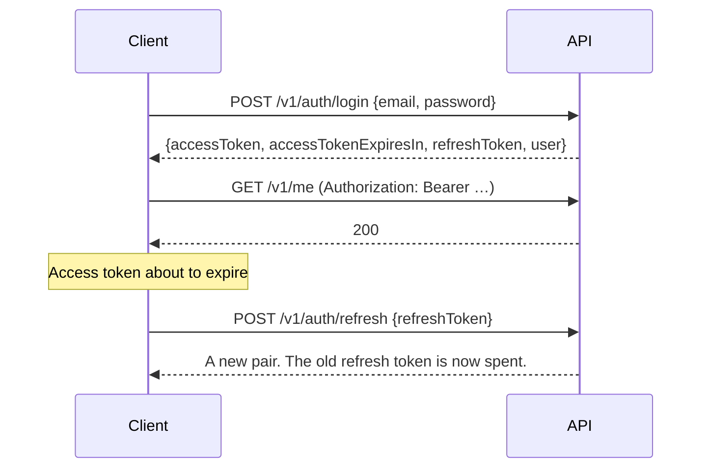

# API reference

The phone app and the website both use one REST API: [`api/`](https://github.com/KingCharlesVI/fh-watch/tree/main/api), on Fastify and PostgreSQL. Every route is under **`https://app.fhmatchcentre.com/v1`**.

This page gives an overview. For each route's exact request and response, see the interactive docs, which are generated from the route schemas and so always match the running API:

- **[app.fhmatchcentre.com/v1/docs](https://app.fhmatchcentre.com/v1/docs)** (Swagger UI)
- Locally, http://localhost:3001/v1/docs while `pnpm dev` is running

The response types the phone app and website use are in [`packages/shared/src/api-types.ts`](https://github.com/KingCharlesVI/fh-watch/blob/main/packages/shared/src/api-types.ts).

## Authentication

The API uses **bearer tokens**. Sign in to get a token pair, then send the access token on each request:

```http
Authorization: Bearer <accessToken>
```

| Token | Lasts | Used for |
| --- | --- | --- |
| Access token (a JWT) | 15 minutes | The `Authorization` header |
| Refresh token | 30 days | `POST /auth/refresh`, to get a new pair |



- **No header means a public request.** Public routes, such as published matches and clubs, need no token. Any other route answers `401` without one.
- **A bad or expired token is always a `401`**, even on a public route, so the client knows to refresh rather than quietly seeing less.
- **Refresh tokens rotate.** Each refresh spends the old token. Two refreshes that race within 30 seconds are both accepted. Reusing a spent token after that ends the whole sign-in session (`refresh_token_reused`), in case the token was stolen.
- **Signing in needs a confirmed email address.** Otherwise login returns `403 email_not_verified`.
- **Changing or resetting a password signs out every device.**
- **Rate limits:** login, register, email verification and password reset allow 10 attempts per 15 minutes per IP address, and per email address where there is one, then answer `429`. Changing your password allows 10 attempts per 15 minutes per account.
- **General limits:** every other request is limited to 600 a minute per IP address, and CSV and PDF downloads to 30 a minute. Over a limit, the API answers `429 rate_limited` with a `Retry-After` header in seconds. `/v1/health` isn't counted.
- **Register and forgot-password always answer `202`**, whether or not the address has an account, so they can't be used to find out who's registered.

The website keeps the tokens in HTTP-only cookies and refreshes them before each page loads. The phone app keeps them in the device's secure storage.

## Roles

An account has one or more roles. What each role can do is defined in [`packages/shared/src/policy.ts`](https://github.com/KingCharlesVI/fh-watch/blob/main/packages/shared/src/policy.ts), which the API, website and phone app all use.

| Role | Can |
| --- | --- |
| *Public* (no token) | See published matches, clubs, teams, venues and competitions |
| `umpire` | Upload matches; edit, publish and see the history of matches they umpired |
| `club_admin` | See their club's matches, including drafts; add and rename their club's teams |
| `admin` | Everything: users, clubs, club logos, venues, competitions, requests, deleting matches |

A match the caller isn't allowed to see answers `404`, not `403`, so draft matches can't be found by guessing IDs.

## Conventions

- **JSON in and out**, except for exports (CSV, PDF) and club logos (images).
- **Errors** are [problem details](https://www.rfc-editor.org/rfc/rfc9457) (`application/problem+json`). `type` is a stable slug for code to check; `title` is a message to show people:

  ```json
  {
    "type": "/problems/validation",
    "title": "The request is not valid.",
    "status": 400,
    "errors": [{ "path": "/name", "message": "Too small: expected string to have >=2 characters" }]
  }
  ```

- **Lists** return `{ "items": [...] }`. The long ones (`/matches` and `/users`) are paged: pass `limit` (1–100, default 50), then send back the `nextCursor` from each response as `cursor`, until it is `null`.
- **Saving a match** works with revisions. `GET /matches/:id` returns the current revision as an `ETag`. To change an existing match, send it back as `If-Match: "<revision>"`: leaving it out returns `428`, and a stale revision returns `412`. Re-sending the current document changes nothing, so retrying an upload is safe. An admin merging duplicate teams, venues or competitions saves a new revision of each match it changes, so a phone holding an older copy fetches the new one, and an edit made from the old one gets `412`.
- **IDs** are UUIDs. A match's ID is created by the watch (a UUIDv7), so the same match uploaded twice stays one match.

## Endpoints

🔓 public · 🔑 signed in · 🛡️ admin. "Signed in" routes may also check what the user can do with that particular match or club.

### Accounts

| | Route | |
| --- | --- | --- |
| 🔓 | `POST /auth/register` | Create an umpire account, optionally with a club request. Sends a confirmation email |
| 🔓 | `POST /auth/resend-verification` | Send the confirmation email again |
| 🔓 | `POST /auth/verify-email` | Confirm the address with the emailed token |
| 🔓 | `POST /auth/login` | Email and password to a token pair and the user |
| 🔓 | `POST /auth/refresh` | Refresh token to a new pair |
| 🔓 | `POST /auth/logout` | End the session the refresh token belongs to |
| 🔓 | `POST /auth/forgot-password` | Email a password reset link |
| 🔓 | `POST /auth/reset-password` | Set a new password with the emailed token |
| 🔑 | `GET /me` | Your account |
| 🔑 | `PATCH /me` | Change your display name or password |
| 🔑 | `DELETE /me` | Ask an admin to delete your account |
| 🔑 | `POST /me/push-tokens` | Register a phone for notifications |
| 🔑 | `DELETE /me/push-tokens/:token` | Unregister one |
| 🔑 | `GET /umpires?q=` | Find registered umpires by name, to add as umpire 2 |

### Matches

| | Route | |
| --- | --- | --- |
| 🔓 | `GET /matches` | Matches you can see, newest first. Filters: `clubId`, `teamId`, `umpireId`, `from`, `to`, `competition`, `venue`, `status` (`competition` and `venue` match names containing them, in any capitals) |
| 🔓 | `GET /matches/:id` | A match: its document, summary and umpires |
| 🔓 | `GET /m/:shareCode` | The same, by its six-character share code |
| 🔓 | `GET /matches/:id/export.json` · `.csv` · `.pdf` | Download a match |
| 🔑 | `GET /matches/export.csv` | Every match you can manage as one CSV (at most 5,000) |
| 🔑 | `PUT /matches/:id` | Upload a match, or save a new revision (see [Conventions](#conventions)) |
| 🔑 | `PUT /matches/:id/umpires/2` | Set the second umpire, by user ID or by name |
| 🔑 | `DELETE /matches/:id/umpires/2` | Remove them |
| 🔑 | `POST /matches/:id/publish` | Make it public, with a share code |
| 🔑 | `POST /matches/:id/unpublish` | Hide it again |
| 🔑 | `GET /matches/:id/revisions` | Its edit history |
| 🔑 | `GET /matches/:id/revisions/:revision` | One past revision's document |
| 🛡️ | `DELETE /matches/:id` | Delete it (purged after 30 days) |

The match document itself is described in [The match format](technical/match-format.md).

### Clubs and teams

| | Route | |
| --- | --- | --- |
| 🔓 | `GET /clubs?q=` | All clubs, by name |
| 🔓 | `GET /clubs/:idOrSlug` | A club and its teams |
| 🔓 | `GET /clubs/:id/teams` | A club's teams |
| 🔓 | `GET /teams?q=` | Search teams by club and team name, e.g. `hawks m1` |
| 🔓 | `GET /clubs/:id/logo` | The club's logo image. Clubs give its path as `logoUrl`, which changes when the logo does |
| 🛡️ | `POST /clubs` | Add a club |
| 🛡️ | `PATCH /clubs/:id` | Rename it or change its web address |
| 🛡️ | `DELETE /clubs/:id` | Delete it and its teams |
| 🛡️ | `POST /clubs/:id/merge` | Merge a duplicate club into another, `{ into }`: its teams move across (one with the same slug there is merged into it), as do its club admins, requests and, if the other has none, its logo. Then it's deleted. Answers `{ into, matches }`, how many matches changed |
| 🛡️ | `PUT /clubs/:id/logo` | Set its logo: the image itself as the body, with `Content-Type: image/png`, `image/jpeg` or `image/webp`, up to 512 KB |
| 🛡️ | `DELETE /clubs/:id/logo` | Remove it; the initials show instead |
| 🔑 | `POST /clubs/:id/teams` | Add a team (admins, or that club's admin) |
| 🔑 | `PATCH /clubs/:id/teams/:teamId` | Rename a team (admins, or that club's admin) |
| 🛡️ | `DELETE /clubs/:id/teams/:teamId` | Delete a team; its matches keep the name |
| 🛡️ | `POST /clubs/:id/teams/:teamId/merge` | Merge a duplicate team into another (any club's), `{ into }`: its matches are linked to that team. Answers `{ into, matches }` |

### Venues and competitions

Two lists of names that umpires pick from: the grounds matches are played at (not tied to any club), and the leagues and cups. Both work the same way, at `/venues` and `/competitions`. A match keeps its venue and competition as text, so renaming or deleting one never changes a match; merging does.

| | Route | |
| --- | --- | --- |
| 🔓 | `GET /venues?q=` · `GET /competitions?q=` | All of them by name; with `q`, those whose name has every word of it, e.g. `banbury road` |
| 🔑 | `POST /venues` · `POST /competitions` | Add one, `{ name }`: 2 to 120 characters (umpires and admins). `201` with the new one; `200` with the one already there if the name matches in any capitals |
| 🛡️ | `PATCH /venues/:id` · `PATCH /competitions/:id` | Rename it |
| 🛡️ | `DELETE /venues/:id` · `DELETE /competitions/:id` | Delete it |
| 🛡️ | `POST /venues/:id/merge` · `POST /competitions/:id/merge` | Merge a duplicate into another, `{ into }`: matches with its name, in any capitals, take the other's, and it's deleted. Answers `{ into, matches }` |

### Requests

| | Route | |
| --- | --- | --- |
| 🔑 | `POST /club-requests` | Ask to administer a club, or for a missing club to be added |
| 🔑 | `GET /club-requests` | Your requests; admins see everyone's |
| 🛡️ | `POST /club-requests/:id/approve` | Add the club and/or make them its club admin |
| 🛡️ | `POST /club-requests/:id/reject` | Turn it down |
| 🔓 | `POST /access-requests` | Ask to join the Google Play or TestFlight test (from the landing page only) |
| 🛡️ | `GET /access-requests` | Every test request |
| 🛡️ | `POST /access-requests/:id/approve` · `deny` | Answer one, by email |

### Admin: users

| | Route | |
| --- | --- | --- |
| 🛡️ | `GET /users` | Search users. Filters: `q`, `role`, `deletionRequested` |
| 🛡️ | `GET /users/:id` | One user |
| 🛡️ | `PATCH /users/:id` | Set their name, roles and club |
| 🛡️ | `DELETE /users/:id` | Delete them; their matches stay |

## Trying it

```sh
API=http://localhost:3001/v1

# Sign in, keeping the access token
TOKEN=$(curl -s $API/auth/login -H 'content-type: application/json' \
  -d '{"email":"you@example.com","password":"…"}' | jq -r .accessToken)

curl -s $API/me -H "authorization: Bearer $TOKEN"

# Public: no token needed
curl -s "$API/matches?limit=5"
```

In Swagger UI, choose **Authorize** and paste an access token to try the signed-in routes.

To make yourself an admin locally, register on the website, then run `pnpm --filter @fh/api admin:grant you@example.com --verify` (`--verify` confirms the email address too, for when email isn't set up).
