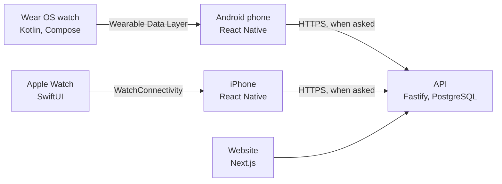

# Technical overview

FH Match Centre is one monorepo ([github.com/KingCharlesVI/fh-watch](https://github.com/KingCharlesVI/fh-watch)): two native watch apps, a React Native phone app, a TypeScript API and two websites, sharing one match format.

## The parts

| Path | What | Tech |
| --- | --- | --- |
| `packages/shared` | The match schema (Zod), validation, scores, descriptions, CSV and the match report, the API's response types, permissions and club umpiring rules, used by the phone app, API and website | TypeScript |
| `schema/match.schema.json` | The same schema as JSON Schema, generated, for the watch apps' tests | JSON Schema |
| `watch-wear` | The Wear OS umpire app | Kotlin, Jetpack Compose for Wear OS, Room |
| `mobile/targets/watch` | The Apple Watch umpire app, built into the iPhone app | Swift, SwiftUI, HealthKit |
| `mobile` | The phone app for Android and iPhone, with native modules for watch sync, file sharing and Health Connect | Expo (React Native) |
| `api` | The REST API: accounts, matches with revisions, clubs, publishing, imports, club umpiring, emails | Node, Fastify, Drizzle, PostgreSQL |
| `web` | The website: results, search, clubs, dashboards, club umpiring, admin (app.fhmatchcentre.com) | Next.js, shadcn/ui, Tailwind |
| `landing` | The landing page and privacy policy (fhmatchcentre.com), on Vercel | Next.js (static) |
| `docs-site` | These docs (docs.fhmatchcentre.com), on Vercel | docsify |
| `deploy` | Running the API and website on a server behind a Cloudflare Tunnel | Node, shell, PowerShell |

## The ideas that hold it together

- **A match is its settings plus an event log.** The score, cards and timeline are always worked out from the events, so they can't disagree. Events are never deleted: a mistake is cancelled with a `void` event. See [The match format](technical/match-format.md).
- **The watch creates the match ID** (a UUIDv7), so a match keeps one identity from the watch to the website, and sending it twice can't make a duplicate.
- **Both watch apps have the same engine**: the Kotlin and Swift engines are ports of each other with the same tests, and both write documents the phone checks against the shared schema.
- **Offline first.** The watch needs nothing else during a match. The phone stores everything locally and uploads only when the umpire asks.
- **Sync never loses a match.** The watch keeps a match until the phone confirms it has stored it; the phone confirms only after writing it to disk.

## Where to read more

- [Development setup](technical/development.md): running everything locally.
- [API reference](technical/api.md): authentication, roles and every endpoint.
- [Design](technical/design.md): the full design, from the data model to the watch sync protocol and the milestones.
- [Releasing](technical/releasing.md), [Google Play](technical/play-store.md) and [Deployment](technical/deployment.md).
- The READMEs in the repository, especially [watch-wear](https://github.com/KingCharlesVI/fh-watch/blob/main/watch-wear/README.md) and [landing](https://github.com/KingCharlesVI/fh-watch/blob/main/landing/README.md).
