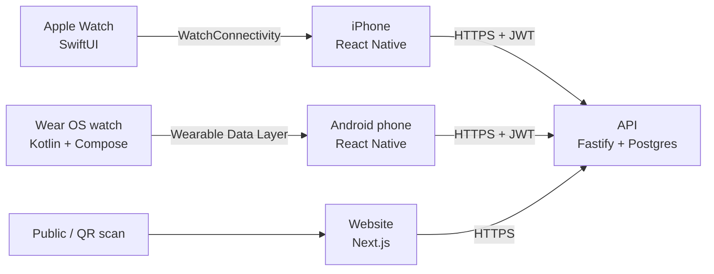
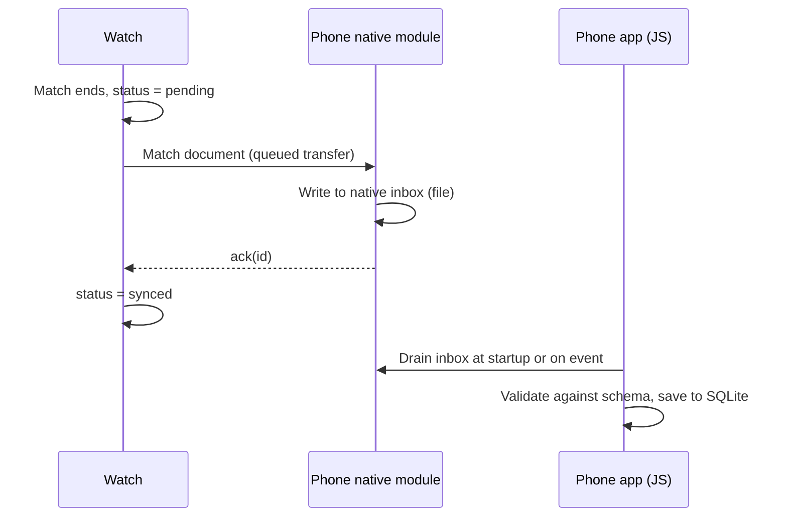
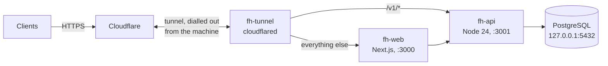

# Field Hockey Match System — Design

Last updated: 2026-09-23

## Overview & goals

The system gets a field hockey match from an umpire's wrist to a public web page with no retyping. It has four parts:

| Component | Users | Job |
| --- | --- | --- |
| Watch app (Wear OS + watchOS) | Umpires | Run the match: clock, goals, cards, penalty corners, shootouts. Works offline, then syncs to the phone. |
| Mobile app (iOS + Android) | Umpires | Receive matches from the watch, review and correct them, upload, share by QR code or link. |
| API | Mobile app, website | Accounts, matches, clubs and teams, permissions, exports. |
| Website | Public, umpires, club admins, admins | Public match pages, downloads (JSON/CSV/PDF), admin tools. |

**Goals**

- Umpiring on the watch works as well as MatchGear, with the physical button controlling the clock.
- A finished match reaches the phone automatically, with no manual export.
- An umpire can publish a corrected match within 2 minutes of the final whistle.
- One match format is used by every component, so nothing is lost between them.

**Out of scope for v1**

- Live scoring during the match, not before v3 at the earliest. The watch only syncs after the match.
- League tables, fixtures and player registration.
- A scorer or team-manager app. Only umpires record matches.

## System architecture

The mobile app, API and website are all TypeScript and share one types package. The two watch apps are native, because no cross-platform framework supports both Wear OS and watchOS.



Pairing is platform-bound: an Apple Watch pairs only with an iPhone, and a Wear OS watch in practice only with an Android phone. So the phone app needs a small native bridge on each platform.

**Repository layout (one monorepo, pnpm workspaces)**

| Path | Contents | Tech |
| --- | --- | --- |
| `schema/` | `match.schema.json`, the match contract the watch apps build against. Generated from the Zod schema by `pnpm gen:schema`; a test fails if it's out of date. | JSON Schema (draft 2020-12) |
| `packages/shared/` | Zod match schema (the authoring source) and its inferred types, validation, score calculation, CSV builder | TypeScript, Zod |
| `watch-wear/` | Wear OS umpire app | Kotlin, Jetpack Compose for Wear OS |
| `mobile/` | Phone app, with native modules for watch sync | React Native (Expo dev build) |
| `mobile/ios/…Watch App/` | watchOS umpire app, built inside the iOS Xcode project | Swift, SwiftUI |
| `api/` | REST API and database migrations | Node.js, Fastify, Drizzle ORM, PostgreSQL |
| `web/` | Public site and admin area | Next.js (App Router), shadcn/ui, Tailwind CSS |
| `deploy/` | The `fh` operations command, provision scripts, systemd units and Windows service definitions | Node, shell, PowerShell |

The watchOS app has to ship inside the iOS app bundle, so it lives in the Expo project's `ios/` folder. It's added as an Xcode target, using an Expo config plugin so it survives rebuilds.

## Match data model

A match is its settings plus an ordered log of events. The score, card counts and timeline are all worked out from the events, so they never disagree. The watch creates the match ID (UUIDv7), so a match keeps one identity from the watch to the website and a retried upload can't create a duplicate.

**Match document (the watch → phone → API format)**

```json
{
  "schemaVersion": 1,
  "id": "0192a1b4-7c3e-7d2a-9f10-3b5e8c1d2a47",
  "createdOn": "wear",
  "settings": {
    "periods": 4, "periodLengthSec": 900,
    "breakLengthsSec": [120, 300, 120],
    "cardDurationsSec": { "green": 120, "yellowShort": 300, "yellowLong": 600 },
    "shootoutIfDrawn": true
  },
  "teams": {
    "home": { "name": "Oxford Hawks M1", "teamId": null, "color": "#1E40AF", "captain": 7 },
    "away": { "name": "Reading M1", "teamId": null, "color": "#B91C1C", "captain": null }
  },
  "venue": "Oxford Hawks, Pitch 1",
  "competition": null,
  "startedAt": "2026-09-19T13:02:11Z",
  "endedAt": "2026-09-19T14:14:02Z",
  "events": [
    { "seq": 1, "type": "period_start", "period": 1, "clockMs": 0, "wallTime": "2026-09-19T13:02:11Z" },
    { "seq": 2, "type": "goal", "team": "home", "player": 9, "period": 1, "clockMs": 412000 },
    { "seq": 3, "type": "card", "team": "away", "player": 4, "color": "yellow", "durationSec": 300, "period": 1, "clockMs": 530500 },
    { "seq": 4, "type": "penalty_corner", "team": "home", "period": 1, "clockMs": 601000 }
  ]
}
```

The settings above are one example. Period count, period length and break lengths are all set per match on the watch, from a preset or custom values.

**Event types**

| Type | Fields | Notes |
| --- | --- | --- |
| `period_start` / `period_end` | period | A break is the gap between one period's end and the next one's start. |
| `clock_stop` / `clock_resume` | reason? (`injury`, `video`, `other`) | Stoppages for injury, video referral and so on. |
| `goal` | team, player?, method? (`field`, `pc`, `ps`) | method = field goal, penalty corner or penalty stroke. |
| `card` | team, player?, color, durationSec | green, yellow or red. Green is 2 min. Yellow is 5 or 10 min, picked when the card is given (durationSec 300 or 600). Red has no duration. |
| `card_end` | refSeq | Written automatically when a suspension timer runs out. |
| `penalty_corner` | team | Counted per team. |
| `penalty_stroke` | team, scored | Optional. |
| `shootout_attempt` | team, round, player?, scored | Only after a drawn match when `shootoutIfDrawn` is set. |
| `void` | refSeq | Undo. Cancels an earlier event without deleting it. |
| `note` | text | Free-text note added on the phone. |

Every event carries `seq` and, when recorded on the watch, `wallTime` (UTC). Events on the match clock also carry `period` and `clockMs` (match-clock time); shootout attempts use `round` instead, and voids and notes may omit them. Edits made on the phone are stored as new revisions, so the original watch record is always kept.

- `seq` is the log order: unique and ascending in the array, gaps allowed. Events added on the phone take the next `seq`, and the timeline sorts by `period` and `clockMs`, so they slot into place.
- Only `goal` events count towards the score. A scored `penalty_stroke` needs a matching goal with method `ps`; validation warns if they don't match.
- Unknown fields are rejected, so a newer watch must bump `schemaVersion`.
- `endedAt` is the final whistle and starts the auto-publish window. If it's missing, the last `period_end` wall time is used.
- Validation (`parseMatch`) returns errors, which block an upload, and warnings, which the umpire reviews (for example a card length that differs from the match settings).

**Database tables (PostgreSQL)**

| Table | Key columns |
| --- | --- |
| `users` | id, email, password_hash (argon2id), display_name, roles (set of `admin` / `umpire` / `club_admin`), club_id? (set when roles include `club_admin`), email_verified_at |
| `clubs` | id, name, slug |
| `club_requests` | id, user_id, club_id? (existing club) or club_name (new club), status (pending/approved/rejected), reviewed_by, reviewed_at |
| `teams` | id, club_id, name (e.g. "Men's 1s"), slug |
| `matches` | id (watch UUID), home_team_id?, away_team_id?, home_name, away_name, venue?, competition?, played_at, status (`draft` / `published`), current_revision, share_code, auto_publish_at |
| `match_umpires` | match_id, slot (1 or 2), user_id?, name. user_id is empty when that umpire isn't registered. |
| `match_revisions` | match_id, revision, document (jsonb), created_by, created_at, source (`watch` / `mobile` / `web`) |
| `push_tokens` | id, user_id, token, platform (`ios` / `android`), created_at, last_used_at |
| `refresh_tokens` | id, user_id, token_hash, expires_at, revoked_at |
| `audit_log` | actor_id, action, entity, entity_id, at, diff (jsonb) |

Team names on the watch are free text. On the phone the umpire links each name to a real team, which is what gives club admins visibility.

A match has one or two umpires. Whoever recorded it is umpire 1. On the phone they can add umpire 2 by picking a registered umpire, who then gets the same edit rights, or by typing a name for an umpire who isn't on the system.

**One recording per match.** Only one watch uploads each match: umpire 1's. If umpire 2 also ran the clock on their own watch, that recording stays on their phone as a private record and is never uploaded as a second match. When umpire 2 opens a match that the phone doesn't know yet, the phone app offers a choice: upload it as a new match, or discard it because umpire 1 already has.

## Watch app

The watch app does everything MatchGear does and works fully offline. The only extra is syncing to the phone after the match. The same behaviour is built twice, once per platform, and both write the same match document.

**Features**

| Feature | Behaviour |
| --- | --- |
| Screen layout | Kept very close to MatchGear's, so umpires who know it don't have to relearn anything. Based on MatchGear screenshots, to be supplied before the watch milestones. |
| Match setup | Presets such as 4 × 15 min and 2 × 35 min, plus custom period count, period length and break lengths. Team names, colours and, optionally, each team's captain's shirt number (also editable later on the phone). Last-used settings are remembered. |
| Clock | Counts up or down (setting). Stop and start. Stoppages are logged. Time comes from the monotonic system clock, so it stays accurate even if the app is paused. |
| Physical button | Starts and stops the match clock. Coverage differs by platform (see below). |
| Goals | Pick the team, then the scorer's shirt number and method (both optional). Undo is available for 10 s, and afterwards from the event list. |
| Cards | Green 2 min, yellow 5 or 10 min, red. The player's shirt number is required. Suspension timers count only while the match clock runs, per FIH rules. Up to 6 timers can run at once. |
| Penalty corners and strokes | One tap per team. The count shows on the summary screen. |
| Shootout | Offered when a match ends drawn, if enabled. Tracks rounds per team with sudden death. |
| Haptics | One buzz when the clock starts or stops (however it was done) and when a suspension ends; two buzzes at 2 minutes left in a period; three at 1 minute left; long–short–short–long at the end of a period; four quick buzzes at the end of a break. |
| Match list | Past matches are stored on the watch, each with a sync status (Not synced / Synced). |

**Keeping the app running during a match**

- **watchOS:** runs an `HKWorkoutSession`, which keeps the app in the foreground with the screen on and running in the background. This needs HealthKit permission. MatchGear-style apps generally do this.
- **Wear OS:** a foreground service plus the Ongoing Activity API, so the match stays on the watch face and the recents list. Ambient mode shows a low-power clock.

**Physical button: platform limits**

| Platform | What third-party apps can use | Plan |
| --- | --- | --- |
| Wear OS | The main (Home) button is reserved by the system. Galaxy Watch 4 to 7 have a second, lower button that sends Back, which apps receive as a key press. Some other watches have extra "stem" buttons (`KEYCODE_STEM_1` to `3`). Rotary crown or bezel input is available. | While a match is under way (before kickoff, in a period or a break), Back and the stem buttons start and stop the clock on every screen, as does the on-screen Start/Stop button. Predictive back is turned off for the activity so the Back key reaches the app. On Wear OS 6 swiping right also arrives as a Back key, made up by the system; only keys from a real input device (with a scan code) count, so swiping still navigates. Needs checking on a real Galaxy Watch: behaviour with the screen dimmed (ambient). |
| watchOS | The side button and a Digital Crown press are reserved by the system. Crown rotation is available. The Action Button (Ultra models) and double-tap (Series 9+ / Ultra 2+) can trigger an app's main action. | Start/stop on the Action Button and double-tap. Crown rotation scrolls. On-screen button everywhere else. |

**Local storage**

- Wear OS uses Room (SQLite). watchOS uses SwiftData.
- Each event is written as soon as it happens, so a crash or a flat battery loses nothing.
- Synced matches are kept for 30 days, then deleted.

**Wear OS implementation (Milestone 6)**

- The match engine is pure Kotlin (`watch-wear/.../engine`), unit-tested on the JVM. Its documents are checked against `schema/match.schema.json` in the Kotlin tests, and a sample is checked by the TypeScript validator and the phone's tests.
- The clock holds at full time: time in a period never runs past its length, and the umpire ends the period (the physical button does it once time is up). Events recorded after time is up carry the full-time clock.
- Suspension timers run on total match-clock time, so they pause for stoppages and breaks and carry across periods. When one ends, a `card_end` is logged at the exact clock time it ran out, even if the watch was off then.
- Every recorded event can be undone from the match screen for 10 seconds, and from the event list afterwards. A stroke goal writes both the `penalty_stroke` and the `goal`, and undoing either cancels both. Ending a period early or the match asks first.
- A foreground service (type `specialUse`) with an Ongoing Activity keeps the match alive; a partial wake lock (released at the end, capped at 4 hours) makes alerts fire on time with the screen off. Alerts vibrate as alarms, so Do Not Disturb doesn't silence them.
- If the app is killed or the watch restarts mid-match, it resumes where it was: every change is saved, and the clock uses the monotonic clock, falling back to the wall clock across a reboot.
- On the phone, the Expo module `mobile/modules/watch-sync` holds the `WearableListenerService` and the file inbox. It also pulls any match the Data Layer still holds each time the app opens, which covers a missed delivery or a lost acknowledgement.

## Watch-to-phone sync protocol

When a match ends, the watch queues the whole match document with the platform's guaranteed-delivery channel. It marks the match Synced only after the phone confirms it has stored it. Resending is always safe, because the phone treats the match ID as the key: a copy it already has is ignored.

| | watchOS ↔ iOS | Wear OS ↔ Android |
| --- | --- | --- |
| Transport | `WCSession.transferUserInfo` (queued, survives restarts). Documents over ~50 KB go via `transferFile`. | `DataClient.putDataItem` at `/match/{id}`, marked urgent |
| Phone receiver | Native Swift module, activated in `AppDelegate` at launch so no delivery is missed | `WearableListenerService`, which runs even when the app is closed |
| Confirmation to watch | `sendMessage` `{ack: id, rev}`, falling back to `transferUserInfo` | `MessageClient` at `/ack/{id}` |
| Bridge to the JS app | Expo module event `onMatchReceived` plus a native inbox the JS side drains at startup | Same |



The native module confirms receipt once it has written the file, not when the JS app processes it. That way the watch never waits for the phone app to be opened.

**Rules**

- Every message carries `schemaVersion`. The phone accepts its current version and one earlier; anything else goes to a "Needs app update" list and is never dropped.
- A document that fails validation is kept as raw JSON, flagged in the app, and can be exported for debugging.
- A "Resend all unsynced" action on the watch covers a phone that was reinstalled or changed.
- Sync runs in one direction only: watch to phone. In a later version the phone could push team lists and presets to the watch over the same channels.

## Mobile app

The phone app is an inbox for matches from the watch. The umpire reviews a match, links the teams, fixes mistakes and publishes it. Everything is stored on the phone first, so it all works at a ground with no signal. Nothing is uploaded until the umpire taps Upload; after that, the upload waits for a connection.

**Stages.** The phone app is built for one of two stages (`EXPO_PUBLIC_STAGE`, baked in at build time):

- **Alpha:** the watch and the phone only. No account, no sign-in and no network use. Matches are saved on the phone, edited there (including umpire names, kept on the phone), and exported when the umpire chooses: a one-page PDF report (the same report the website prints, rendered on the phone with `expo-print`), the events as CSV, or the match as JSON. Each can be saved to a folder the umpire picks or shared. A backup puts every match in one JSON file, and "Import from a file" reads it back (skipping matches already on the phone). Matches can be deleted from the phone.
- **Beta:** adds the API and website: sign-in, upload, publishing, share links, team linking and umpire 2 from the directory. Exports, backups and deleting stay available.

Upgrading a phone from the alpha to the beta keeps its matches: signing in clears the phone only when a different user signs in.

**Screens**

| Screen | Contents |
| --- | --- |
| Sign in / register | Email and password, forgot password. Tokens are kept in the Keychain (iOS) or Keystore (Android) via `expo-secure-store`. |
| Matches | Tabs: New from watch, Drafts, Published (alpha: New and Saved). Each row shows the teams, score, date and an upload status badge. Published matches with unlinked teams show a "Link teams" badge. |
| Match detail | Score header, per-period summary, event timeline, and card and penalty-corner totals. |
| Edit match | Link the home and away teams to clubs and teams (searchable), set venue and competition, add umpire 2, add, change or void events, and add notes. The score updates live as events change. |
| Publish | Checks that both teams are linked (or confirmed as free text), then uploads. |
| Share | QR code shown full screen, plus a copy-link button and the native share sheet. |
| Settings | Account, watch connection status, notification permission, "Import from file" (a fallback), and sign out. |

**Data and upload**

- Local store: SQLite (`expo-sqlite`). Each match keeps its current document, the original from the watch, the server revision it's based on, the server's last view of it, and its upload state.
- Upload: `PUT /matches/{id}` with the full document. It's idempotent, so repeating it is harmless. A match edited before its first upload sends the watch's original first, so revision 1 is always what the watch recorded.
- Uploading is the umpire's choice: a match, or later changes to it, is uploaded only after they tap Upload ("Upload changes" after the first time). Receiving, importing and editing never upload anything. Publishing, or changing umpire 2, uploads that match's changes first, since both need the server.
- Retries: once asked, a match retries by itself. Network failures and server errors back off from 5 seconds, doubling up to 15 minutes. A network failure stops the run, so it doesn't try every match. The request is stored in SQLite, so it survives restarts. Waiting uploads are retried when the connection comes back and every 20 seconds.
- Refusals: a validation error or permission problem pauses that match and shows why, until the umpire edits it or taps Try again.
- Conflicts: edits carry `If-Match: <revision>`. If the server copy changed meanwhile (412), the app offers "Keep mine" or "Use theirs". If an earlier upload succeeded but its reply was lost, the app sees the server already has its version and settles it without asking.
- Tokens: kept in secure storage. Only one refresh is ever in flight, because the API treats a reused refresh token as theft. If the session ends by itself, the phone keeps its matches, since some may not be uploaded yet. Signing out deliberately clears them, with a warning if any are unsent.
- Matches tabs: **New** means not yet opened on this phone, **Drafts** and **Published** follow the server status. Matches uploaded from elsewhere are listed from the server and downloaded when opened. In the alpha, opened matches are simply **Saved**.
- The sync engine and API client are plain TypeScript, tested against a fake API that can go offline, fail, or lose replies.
- An unpublished match can still be viewed on the phone, but it gets no public link.
- A new match stays a draft until an umpire publishes it or 2 hours pass after the final whistle, whichever comes first. The API runs the timer, so a match uploaded after the 2 hours publishes as soon as it arrives. Unpublishing a match cancels its timer.

**Push notifications**

- After sign-in the app registers its Expo push token with `POST /me/push-tokens`. Sign-out removes it.
- When the API auto-publishes a match, it sends a push to every registered umpire on that match: "Your match *Home v Away* was published automatically. Link the teams so it shows on club pages." The notification is only sent if at least one team is unlinked; otherwise it says the match was published.
- Tapping the notification opens that match's Edit screen.
- Sent through the Expo Push Service, which delivers via APNs and FCM. Tokens that come back as invalid are deleted.

**Share link and QR code**

- On first publish the API creates a short code, for example `https://fhmatchcentre.com/m/K7P2QX`, using 6 characters that don't include 0/O or 1/I.
- The QR code is drawn on the phone (`react-native-qrcode-svg`), so it still works offline once the code exists.
- The link always shows the latest revision.

## API

The API is a versioned REST service (`/v1`) written in Fastify, and all input is checked against the shared schemas. Reading public matches needs no sign-in. Every write needs a signed-in user whose roles allow it.

**Authentication**

- Passwords are hashed with argon2id.
- The access token is a JWT that lasts 15 minutes.
- The refresh token is random, lasts 30 days, is replaced on every use, and only its hash is stored.
- The API takes `Authorization: Bearer <token>` only. The phone app keeps tokens in secure storage; the website's server keeps them in httpOnly, SameSite=Lax cookies and calls the API on the user's behalf.
- Refresh tokens rotate on every use. Presenting an already-used refresh token revokes every token from that sign-in, since it may have been stolen.
- Sign-in is refused until the email address is verified. Following a password-reset link also counts as verifying it.
- Sign-up requires email verification. Password reset uses a single-use link that expires after 1 hour. Mail goes out over SMTP.
- Sign-in and reset requests are rate-limited per IP address and per email, to 10 per 15 minutes.

**Endpoints**

| Method + path | Who | Purpose |
| --- | --- | --- |
| `POST /auth/register` | Public | Create an account, optionally with a club request. Always answers 202, so it can't be used to find out which emails are registered. |
| `POST /auth/resend-verification` | Public | Send a new verification link |
| `POST /auth/login` / `refresh` / `logout` | Public / signed in | Issue, renew and revoke tokens |
| `POST /auth/verify-email`, `/auth/forgot-password`, `/auth/reset-password` | Public | Email flows |
| `GET /me` · `PATCH /me` · `DELETE /me` | Signed in | View or edit your own account; DELETE asks an admin to delete it |
| `POST /me/push-tokens` · `DELETE /me/push-tokens/{token}` | Signed in | Register or remove a device for push notifications |
| `GET /umpires?q=` | Umpire / admin | Find registered umpires by name, to add as umpire 2 |
| `GET /users` · `PATCH /users/{id}` · `DELETE /users/{id}` | Admin | Manage users, set roles, assign club admins |
| `GET /matches` | Public (published only), wider by role | List with filters: club, team, umpire, date range, competition. Paged. |
| `GET /matches/{id}` · `GET /m/{shareCode}` | Public if published | Match document plus the worked-out summary |
| `PUT /matches/{id}` | Umpire (own) / admin | Create or replace. Body `{ source, document }`. Idempotent; changing an existing match needs `If-Match` (428 without it, 412 if stale). Returns the match and any validation warnings. |
| `PUT /matches/{id}/umpires/2` · `DELETE …` | Umpire (own) / admin | Set umpire 2: `{ userId }` for a registered umpire or `{ name }` for anyone else |
| `POST /matches/{id}/publish` · `/unpublish` | Umpire (own) / admin | Change visibility |
| `DELETE /matches/{id}` | Admin | Soft delete for 30 days, then purged |
| `GET /matches/{id}/revisions` · `GET /matches/{id}/revisions/{n}` | Umpire (own), club admin (own club), admin | Edit history, and any past revision's document |
| `GET /matches/{id}/export.{json,csv,pdf}` | Same as reading the match | Downloads |
| `GET /matches/export.csv?…` | Club admin (own club) / admin | Bulk CSV for a filtered list |
| `GET/POST/PATCH/DELETE /clubs`, `/clubs/{id}/teams` | Read: public · Clubs: admin · Teams: admin or club admin (own club) · Delete: admin | Club and team directory. `GET /clubs/{id or slug}` includes the teams. |
| `GET /teams?q=` | Public | Search teams by club and team name together (e.g. `hawks m1`), for linking a match |
| `GET/POST /club-requests` · `POST /club-requests/{id}/approve` · `/reject` | Signed in (own) / admin | Ask for a new club or to be a club's admin; admins review |

**Background jobs**

- Auto-publish: a job runs every minute, publishes drafts whose `auto_publish_at` has passed, and sends the push notification described under Mobile app.
- Purge: a daily job permanently removes matches soft-deleted more than 30 days ago.
- Both run inside the API process on a timer. Auto-publish selects drafts with `FOR UPDATE SKIP LOCKED`, so two runs at once never publish or notify for the same match twice. Purge is safe to repeat.
- Purge also removes expired refresh tokens and spent or expired email tokens. Revoked refresh tokens are kept until they expire, so reuse of a stolen one is still detected.

**Conventions**

- Errors use RFC 9457 problem+json, for example `{ "type": "…/validation", "title": "…", "status": 422, "errors": […] }`.
- Lists are paged with cursors (`?cursor=&limit=`, at most 100).
- The OpenAPI spec is generated from the route schemas and served at `/v1/docs`.
- Every write goes into `audit_log`.

## Roles & permissions

Admins can do everything. Umpires control every match where they're a registered umpire 1 or 2. Club admins can read every match their club's teams played, including unpublished ones, but can't change them.

An account holds a set of roles, so one person can be both an umpire and a club admin. Their permissions are the union of their roles. Every account gets `umpire` when it registers, with no approval step. A club admin is tied to one club, and a club can have several club admins. Only admins create clubs. Any user can ask for a missing club to be added, or to become a club admin, at sign-up or later, and an admin approves or rejects the request. Approval adds `club_admin` to the user's roles. Club admins can add and edit their own club's teams. Only admins can delete anything.

| Action | Public | Umpire | Club admin | Admin |
| --- | --- | --- | --- | --- |
| View and download published matches | Yes | Yes | Yes | Yes |
| View unpublished matches | — | Own | Own club's | All |
| Upload a match | — | Yes | — | Yes |
| Edit, publish or unpublish a match | — | Own | — | All |
| Delete a match | — | — | — | All |
| View a match's edit history | — | Own | Own club's | All |
| Bulk CSV export | — | Own | Own club's | All |
| Edit own account, ask an admin to delete it | — | Yes | Yes | Yes |
| Request a new club or club-admin role | — | Yes | Yes | Creates directly |
| Manage clubs and teams | — | — | Add and edit own club's teams | Yes |
| Manage users and roles | — | — | — | Yes |

"Own club's" means the home or away team belongs to the club admin's club. Checks run in one API policy module, `can(user, action, match)`, which allows an action if any of the user's roles allows it. The website and phone app use the same module only to hide buttons, never to enforce access.

Deleting an account keeps its published matches, which become "Umpire: deleted user". Deleting a user's matches too is a separate admin action.

## Website & exports

The website is a Next.js app. Public pages are rendered on the server, so shared links open fast and show previews in chat apps. Signed-in users get a dashboard that changes with their roles.

**How it talks to the API**

- All API calls happen on the website's server; the browser never holds an API token. Sign-in stores the access and refresh tokens in httpOnly, SameSite=Lax cookies (Secure in production).
- A Next.js proxy (middleware) runs before each page. When the access token is missing or within 60 seconds of expiring, it swaps the refresh token for a new pair first. Parallel requests share one refresh, and the API gives a just-used refresh token 30 seconds' grace, so a page with several requests can't sign the user out.
- Forms are server actions. The API's problem responses become the error shown under the form.
- The website passes the visitor's `X-Forwarded-For` on to the API, so sign-in rate limits apply per visitor rather than to the web server.
- Downloads go through the website (`/matches/{id}/export/{format}`, `/dashboard/export`), which adds the visitor's token, so signed-in users can download drafts too.
- The match editor checks the document with the shared validator as you type and saves with `If-Match`; a conflicting save asks the umpire to reload.

**Public pages**

| Route | Contents |
| --- | --- |
| `/` | Latest published matches, and search by club or team |
| `/m/{shareCode}` | Match page: score, period scores, goal and card timeline, penalty-corner count, shootout, umpires, venue. Download buttons. Open Graph image with the score. |
| `/clubs/{slug}`, `/clubs/{slug}/{team}` | A club's or team's published matches, with results |

**Signed-in pages**

| Route | Roles | Contents |
| --- | --- | --- |
| `/dashboard` | All | My matches (umpire) and/or Club matches (club admin), with filters |
| `/matches/{id}/edit` | Umpire (own), admin | Same edit features as the phone app, for fixes made at a desk |
| `/admin/users`, `/admin/clubs`, `/admin/club-requests` | Admin | User roles, club-admin assignment, club and team directory, request review |

**Export formats**

| Format | Contents | How it's made |
| --- | --- | --- |
| JSON | The full match document (latest revision) plus the worked-out summary | Served directly |
| CSV | One row per event: period, clock, team, type, player, detail. Bulk export gives one row per match with the score and totals. | Shared CSV builder in `packages/shared` |
| PDF | A one-page A4 match report: header, score, periods, statistics, event table, umpires, share link | Built by the API: an HTML template printed to PDF by headless Chromium (Playwright). Cached on disk per match version, i.e. every revision, publish or umpire change makes a new one. 503 if Chromium isn't available. |

Unpublished matches are never shown to the public. Their URLs return 404, so visitors can't tell whether a hidden match exists.

## Deployment

Everything runs directly on one machine, Linux or Windows, with no containers. A Cloudflare Tunnel connects it to fhmatchcentre.com: `cloudflared` dials out to Cloudflare, which terminates HTTPS and forwards requests back through the tunnel. The machine needs no public IP address, open ports or certificates, so a spare PC at home works while the user base is small, and moving to a VPS later is the same Linux setup. 2 CPU cores, 4 GB RAM and 40 GB of disk is enough for thousands of matches; PDF rendering is the heaviest job. The step-by-step runbook is [deployment.md](deployment.md); the files are in `deploy/`.



| Concern | Linux (Ubuntu 22.04+ / Debian 12+) | Windows 10/11 |
| --- | --- | --- |
| Setup | `deploy/linux/provision.sh`, run once as root. Safe to run again. | `deploy/windows/provision.ps1`, run once as administrator. Safe to run again. |
| Processes | systemd units `fh-api`, `fh-web`, `fh-tunnel`, each as its own unprivileged user, with sandboxing (read-only system, private /tmp). | Windows services `fh-api`, `fh-web`, `fh-tunnel` via WinSW (a pinned, checksummed download), each under its own virtual account (`NT SERVICEh-api`) with folder permissions to match. |
| Settings | `/etc/fh/*.env` | `C:ProgramDatahconfig*.env`, read with `node --env-file` |
| Operations | The `fh` command, one Node script (`deploy/fh.mjs`) for both systems: `deploy`, `rollback`, `status`, `logs`, `backup`, `restore`, `restore-test`, `admin`, `tunnel`. | Same. |
| Deploys | `fh deploy <tag>`: clone into `releases/<time>-<tag>`, install and build (as `fh-deploy` on Linux), migrate, point `current` at it (a symlink on Linux, a junction on Windows), restart, health-check. An unhealthy release is switched back automatically. The last 5 releases are kept. | Same. |
| Public access | Cloudflare Tunnel set up by `fh tunnel`: creates the tunnel, adds DNS records for the domain and www, writes the routing rules. Cloudflare handles TLS. The site sends HSTS and the usual security headers itself; `www` redirects to the main address. | Same. |
| Visitor IPs | Cloudflare puts each visitor's address in `CF-Connecting-IP`. The API uses it for rate limits (`CLIENT_IP_HEADER`), and only from proxies on the same machine. | Same. |
| Caching | API responses are `no-store` unless a route says otherwise, because Cloudflare caches URLs ending in `.csv` and `.pdf` by default. | Same. |
| Database | PostgreSQL from the distribution's packages. The API connects over 127.0.0.1 as the `fh` role with a generated password. Backups and restores use the same role, so no superuser is needed after setup. | PostgreSQL from the EnterpriseDB installer; otherwise the same. |
| Backups | Nightly `pg_dump` (`fh-backup.timer`), 14 days kept, off-site with `rclone` once configured. A weekly timer restores the newest into a scratch database. `fh restore` runs in one transaction, so a failed restore changes nothing. | The same, as Task Scheduler jobs running as SYSTEM. |
| Firewall and SSH | `ufw` allows SSH only; the tunnel needs no inbound ports. SSH is key-only once a key is installed. `unattended-upgrades` is on. | Nothing listens beyond 127.0.0.1 (except PostgreSQL if its installer left it open; the script warns). |
| Staying up | Sleep is disabled. Services restart on failure and start at boot. | Sleep on mains power is disabled. Services restart on failure and start at boot, before anyone signs in. |
| Logs and monitoring | journald; `fh logs`. `/v1/health` for an external uptime monitor. | WinSW log files in `C:ProgramDatahlogs`; `fh logs`. |
| PDF | Chromium's headless shell, installed by each deploy; its system libraries by `provision.sh`. | Chromium's headless shell, installed by each deploy. |
| Email | SMTP relay set as `SMTP_URL` in `api.env`. Until then emails go to the log and the API warns at startup. | Same. |
| Push | Expo Push Service over HTTPS, with the access token in `api.env`. | Same. |

## Build plan

The work runs from the server outwards, so every step can be tested end to end before the hardest part, watch sync, is built. Each milestone ends with something that runs.

| # | Milestone | Done when |
| --- | --- | --- |
| 1 | Monorepo, schema, shared package | The JSON Schema and TS types are generated, and score calculation and the CSV builder have unit tests with sample matches |
| 2 | API core | Auth, users, roles, clubs and teams, match upload and edit with revisions, auto-publish job. Integration tests against a real Postgres. |
| 3 | Website (public + admin) | Match pages, JSON/CSV/PDF downloads, dashboards, admin screens |
| 4 | Server deployment | Running on a Linux or Windows machine behind a Cloudflare Tunnel, with backups and a deploy command |
| 5 | Mobile app without watch | Sign in, import a match from a file, edit, publish, share by QR code or link, offline upload queue, push notifications. Expo SDK 57 with Expo Router; editing uses the same shared functions as the website. |
| 6 | Wear OS app + Android sync | Full umpiring features. A match reaches the phone automatically. Tested at a real match. Built: the app, sync and phone receiver, tested on emulators (see below); the match screen is now swiped pages (timing, cards, goals, phone, match), after MatchGear. Still to do: a paired end-to-end test and a real match. |
| 7 | Alpha (Android) | Watch and phone only: no account, matches saved and exported on the phone (PDF, CSV, JSON, backups), uploads only when the umpire asks. Released to umpires through Google Play internal testing ([play-store.md](play-store.md)). |
| 8 | watchOS app + iOS sync | Same features as Wear OS, including workout session, Action Button and double-tap |
| 9 | Beta | The API and website in the apps: sign-in, upload, publishing. Closed testing on Google Play (Google requires 12 testers for 14 days before production) and TestFlight. |

The watchOS work (8) doesn't depend on the Android alpha and can run alongside it. Releasing the iOS and watchOS apps needs an Apple Developer account ($99/yr) and a Mac. The Google Play Console account is in place.

## Open questions & risks

**Open questions**

- [ ] Which SMTP provider? (Until one is set, emails are written to the API log.)
- [ ] Auto-publish now that uploads are manual: the 2-hour window starts at the final whistle, so a match first uploaded more than 2 hours later publishes as soon as it arrives. Start the window at the first upload instead? (Decide before the beta.)
- [ ] Which machine to run on? A spare Windows or Linux PC behind a Cloudflare Tunnel for now; a VPS later if needed.

**Decided**

- Umpires can edit every match where they're a registered umpire 1 or 2.
- A match has one or two umpires; both registered umpires can edit it.
- Only one watch uploads each match (umpire 1's).
- A new match stays a draft until published, or auto-publishes 2 hours after the final whistle, with a push notification to the umpires.
- Only admins create clubs; club admins add and edit their own club's teams; users can request clubs and club-admin status.
- Anyone can register as an umpire, with no approval.
- Accounts hold a set of roles.
- Live scoring is out of scope until v3 at the earliest.
- The watch screen layout follows MatchGear's; screenshots will be supplied before the watch milestones.
- The site is FH Match Centre at https://fhmatchcentre.com. Email goes out as no-reply@fhmatchcentre.com.
- The website's UI uses shadcn/ui (Radix + Tailwind CSS v4), with light and dark themes.

**Risks**

| Risk | Impact | Mitigation |
| --- | --- | --- |
| watchOS gives no access to the side button | Umpires on non-Ultra watches older than Series 9 have no physical start/stop | Large on-screen button plus crown gestures. Document which models are supported. |
| Physical buttons differ between Wear OS models | The button may do nothing on some watches | Test on the most common models. Add a setting to pick which button is used. |
| Watch sync fails silently when the phone app has been force-closed | Match seems lost | Native inbox, confirmation only after writing to disk, and a "Resend unsynced" action on the watch |
| Battery drain on a 70-minute match plus breaks | Watch dies mid-match | Dark UI, ambient mode, no network during the match, and a test of battery use on each platform |
| React Native watch bridges are custom native code | More upkeep with each Expo upgrade | Keep the bridge small, send the document only, and give it its own tests |
| Self-hosted server is a single point of failure | Website down, uploads fail | The phone app queues uploads offline. Off-site backups. A restore is rehearsed. |
| Hosting at home (power cuts, broadband outages, the PC being switched off) | Site down until the machine is back | Fine while testing. Services and the tunnel come back by themselves after a restart. Moving to a VPS is the same Linux setup plus `fh tunnel`, and a backup restore. |
| Close copy of MatchGear's visual design | Intellectual property complaint | Match the workflow and layout, but use original icons, artwork and styling |
